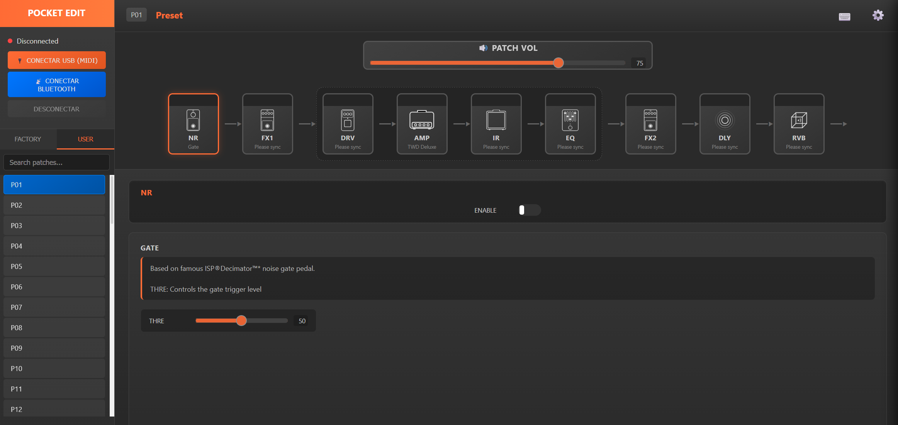

# **PocketEdit** 🎸

**PocketEdit** is a powerful, mobile-friendly, browser-based web application designed for deep, real-time control over your **Sonicake Pocket Master** multi-effects pedal. It provides a sleek, modern graphical interface to manage presets, edit effects in real-time, customize your theme, and visualize your signal chain—all without installing any software or apps.

Written purely in HTML, CSS, and JavaScript, **PocketEdit** runs directly in your web browser on PC, Mac, Android, and iOS devices. 

---

## **🌐 Online Access**

You can access PocketEdit online anytime:  

[Online App](https://icandia-nvy.github.io/PocketEdit-Mobile/) 

Alternatively, you can clone or download this repository and double-click `index.html` to run it locally offline.

---

## **✨ Key Features**

### 🔌 **Connectivity & Device Sync**
* **Dual Connectivity:** Supports both **USB WebMIDI** (works in Chrome, Edge, Firefox) and **Web Bluetooth** (wireless on Chromium browsers).
* **Two-Way Real-Time Sync:** Changes made physically on the pedal are reflected live in the browser editor and vice versa.
* **Automatic Device Sync:** Automatically reads and syncs preset names, effect models, user IR slots, and global levels upon connection.
* **Instant CRC-8 Preset Saving:** Instantaneous, reliable preset writing using optimized CRC-8 calculation.

### 🎛️ **Tone & Signal Chain Editing**
* **Visual Effects Chain:** Click any module (`NR`, `FX1`, `DRV`, `AMP`, `IR`, `EQ`, `FX2`, `DLY`, `RVB`) to open its dedicated parameter controls.
* **Drag-and-Drop Order:** Easily reorder movable modules (`NR`, `FX1`, `FX2`, `DLY`, `RVB`) by dragging them to new positions.
* **Tap Tempo Engine:** Interactive Tap Tempo button with sub-division calculations (1/4, 1/8, 1/8 Dotted, 1/2) for delay synchronization.
* **Unsaved Changes Indicator:** Prompts you with a warning if you attempt to leave or switch presets with unsaved tweaks.

### 🎨 **Custom RGB Accent Theme Manager**
* **RGB Color Picker:** Customize the entire editor's visual style with any accent color of your choice via the Advanced Settings (`⚙️`) panel.
* **Dynamic Real-Time UI Recoloring:** Instantly updates buttons, headers, borders, highlights, active module badges, and slider progress fills.
* **Persistent Preferences:** Automatically saves your custom color theme in `localStorage`. Includes a 1-click **Reset** button to restore the classic orange theme (`#FF6B35`).

### 📱 **Mobile & Live Performance Features**
* **Mobile-First Responsive Design:** Fully optimized UI for smartphones, tablets, and desktop displays.
* **Quick Access Bar:** Fixed bottom bar for live performance on touchscreens with `PREV`, `PATCHES`, `BYPASS`, and `NEXT` quick buttons.
* **Swipe & Touch Gestures:** Slide across preset lists or tap for fast preset switching.
* **Screen Wake Lock API:** Automatically keeps your device screen ON during use or performance to prevent display sleep.

### 📁 **Preset Management & Backup**
* **User & Factory Preset Banks:** Browse and search all 50 User and 50 Factory presets instantly.
* **JSON Preset Export/Import:** Export presets to human-readable JSON files to backup, share, or import custom tones.
* **Advanced Settings Panel:** Adjust Global Volume, Input Level, FX Record Level, BT Record Level, and Monitor Level in one central location.

---

## **⌨️ Keyboard Shortcuts**

Quickly navigate presets, tweak modules, and control the editor using your keyboard:

| Action | Keyboard Shortcut |
| :--- | :--- |
| **Toggle Module Bypass (ON/OFF)** | <kbd>q</kbd> <kbd>w</kbd> <kbd>e</kbd> <kbd>r</kbd> <kbd>t</kbd> <kbd>y</kbd> <kbd>u</kbd> <kbd>i</kbd> <kbd>o</kbd> *(Modules 1 to 9 in order)* |
| **Select / Open Module Controls** | <kbd>Shift</kbd> + <kbd>Q / W / E / R / T / Y / U / I / O</kbd> *(Matches module order)* |
| **Previous / Next Module** | <kbd>←</kbd> / <kbd>→</kbd> or <kbd>[</kbd> / <kbd>]</kbd> |
| **Toggle Selected Module Bypass** | <kbd>b</kbd> |
| **Previous / Next Preset** | <kbd>↑</kbd> / <kbd>↓</kbd> or <kbd>k</kbd> / <kbd>j</kbd> |
| **Switch Preset Bank (User / Factory)** | <kbd>1</kbd> (User) / <kbd>2</kbd> (Factory) |
| **Search Presets** | <kbd>/</kbd> or <kbd>Ctrl</kbd> + <kbd>F</kbd> |
| **Save Preset** | <kbd>Ctrl</kbd> + <kbd>S</kbd> |
| **Export / Import Preset (JSON)** | <kbd>Ctrl</kbd> + <kbd>E</kbd> (Export) / <kbd>Ctrl</kbd> + <kbd>I</kbd> (Import) |
| **Tap Tempo** | <kbd>Space</kbd> |
| **Shortcuts Guide Modal** | <kbd>?</kbd> or <kbd>F1</kbd> |
| **Close Modals** | <kbd>Esc</kbd> |

---

## **📋 Requirements**

* **Hardware:** Sonicake Pocket Master multi-effects pedal.
* **USB Connection (Recommended):** Google Chrome, Microsoft Edge, or Mozilla Firefox.
* **Bluetooth Connection:** Chromium-based browsers (Chrome, Edge, Brave, Opera) with Web Bluetooth support.

---

## **🚀 Getting Started**

1. **Open the App:** Visit the [Online App](https://icandia-nvy.github.io/PocketEdit-Mobile/) or launch `index.html` locally.
2. **Connect Device:** Click **🔌 Conectar USB (MIDI)** or **📡 Conectar Bluetooth** in the top sidebar.
3. **Pair Device:** If using Bluetooth, select **Sonic Master BLE** from the browser dialog and click **Pair**.
4. **Syncing:** Wait a moment while PocketEdit syncs all presets, IRs, and settings from your device.
5. **Start Editing:** Click on presets or effect modules to customize your sound in real-time!

---

## **🙌 Credits & Acknowledgments**

* **USB WebMIDI & Dual Communication:** Big thanks to [@hnikolov](https://github.com/hnikolov) for implementing USB MIDI integration, windowing logic, and two-way hardware sync.
* **CRC-8 Logic:** Optimized preset writing via precise CRC-8 calculation by [@hnikolov](https://github.com/hnikolov).
* Created with reverse-engineering logic, BLE/HCI packet analysis, and AI-assisted development.

---
*Enjoy crafting your ultimate tone with PocketEdit!* 🎸✨
